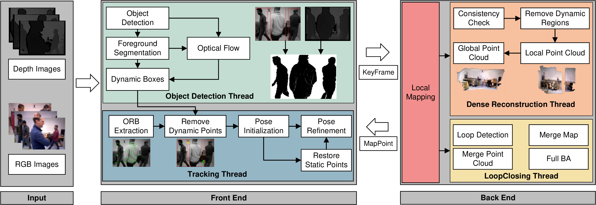

# OVD-SLAM
**OVD-SLAM** is an online visual SLAM for dynamic envionments. The library is the **basic version** of our work. Because some parts of the system are used in a cooperation projects with a company,  some functions are not open-source. However, it can also run on your computers and achieve similar performance to complete OVD-SLAM in the paper.

+ Forground and background feature points recognition by object detection and depth information.

+ Dynamic feature recognition by optical flow with a fast speed.(epipolar error and fundmental matrix in this open-source version) The left person is moving while the right person is just standing.

+ Competitive localization accuracy and robustness in dynamic environments are shown on public datasets and in real world by an AR application.
  
  

# 1. License
This repo is GPLv3 Licensed (inherit ORB-SLAM3). It is built on ORB-SLAM3.
If you use OVD-SLAM in an academic work, please cite:
```
@ARTICLE{10113832,
  author={He, Jiaming and Li, Mingrui and Wang, Yangyang and Wang, Hongyu},
  journal={IEEE Sensors Journal}, 
  title={OVD-SLAM: An Online Visual SLAM for Dynamic Environments}, 
  year={2023},
  volume={23},
  number={12},
  pages={13210-13219},
  doi={10.1109/JSEN.2023.3270534}}

```
# 2. Prerequisties
We have tested the library in Ubuntu 18.04, but it should be easy to compile in other platforms.
A powerful computer with a GPU (tested on i7-11700 and RTX2060) will ensure real-time performance and provide more stable and accurate results.

## C++14 Compiler
The PCL should be compiled by C++14.

## Pangolin
It is same as [ORB-SLAM3](https://github.com/UZ-SLAMLab/ORB_SLAM3).

## OpenCV
We use [OpenCV](http://opencv.org) to manipulate images and features. Dowload and install instructions can be found at: http://opencv.org. **Required at leat 3.0. Tested with OpenCV 3.2.0, 3.4.17 and 4.2.0**.

## Eigen3
Required by g2o. Download and install instructions can be found at: http://eigen.tuxfamily.org. **Required at least 3.1.0. Tested with Eigen 3.3.7**.

## TBB
Intel Threading Building Blocks(TBB) is used to accelerate the Tracking thread. We use parallel computation for acceleration in parts such as feature point extraction.
```
git clone https://github.com/wjakob/tbb.git
mkdir build
cd build
cmake ..
make -j
sudo make install
```
or
```
sudo apt-get install libtbb-dev
```
## PCL
Required by dense point cloud mapping. Download and install instructions can be found at:
[PointCloudLibrary](https://github.com/PointCloudLibrary/pcl) and [Linux](https://pcl.readthedocs.io/projects/tutorials/en/latest/compiling_pcl_posix.html), respectively. **Required at least 1.9. Tested with PCL1.12**.

## DBoW2, g2o, Sophus and Yolov5 (Included in Thirdparty folder)
We use modified version of the DBoW2 library to perform place recognition and g2o library
to perform non-linear optimizations. The Sophus library is used in pose calculation and [Yolov5](https://github.com/jianhengLiu/yolo_ros/tree/tensorrt) is modified 
by TensorRT to provide faster performance. All modified libraries (which are BSD) are included in the *Thirdparty folder*.

## CUDA， cuDNN, TensorRT
For the paper we used CUDA 11.1, cuDNN 8.1.0, and TensorRT 7.2.3.4 with CUDA support. However,
we assume that the code should work with a broad range of versions because it doesn't use version-specific features.
We can sadly not offer a convenient installation script due to (a) different CUDA installation options and (b) the cuDNN download method that needs user input. You have to:
+ Install **CUDA** from [nvidia.com](https://docs.nvidia.com/cuda/cuda-installation-guide-linux/index.html). Make sure that this doesn't interfere with other packages on your system and maybe ask your system administrator. CUDA 11.1 should be in your path, e.g. setting `CUDA_HOME`, `LD_LIBRARY_PATH` and `PATH` should be sufficient. You can also set the symlink `/usr/local/cuda`.

+ Install **cuDNN** from [nvidia.com](https://docs.nvidia.com/deeplearning/cudnn/install-guide/index.html). Make sure to install a version that exactly matches your CUDA and PyTorch versions.
```
export TANDEM_CUDNN_LIBRARY=/path/to/cudnn/lib64
export TANDEM_CUDNN_INCLUDE_PATH=/path/to/cudnn/include
```
+ Install **TensorRT** from [nvidia.com](https://developer.nvidia.com/nvidia-tensorrt-7x-download)
Please change the path in CMakeLists.txt of Yolov5
```
# tensorrt
include_directories(YOUR_PATH_TO_TensorRT/TensorRT-7.x.x.x/include)
link_directories(YOUR_PATH_TO_TensorRT/TensorRT-7.x.x.x/lib)
```
+ Load the engine models from [model](https://drive.google.com/drive/folders/1w5m_tAVRaoQf0NY2m1ajX4lSkqxv8Put?usp=share_link) and set them in `model`. **note: The models provided in the link only support RTX 20X0. If your GPU is RTX 40X0, RTX 30X0, GTX 10X0 or TITAN, you should generate the engine by yourself.**

## Python
Required to calculate the alignment of the trajectory with the ground truth. **Required Numpy module**.

* (win) http://www.python.org/downloads/windows
* (deb) `sudo apt install libpython2.7-dev`
* (mac) preinstalled with osx

## ROS (optional)
We provide some examples to process input of a monocular, monocular-inertial, stereo, stereo-inertial or RGB-D camera using ROS. Building these examples is optional. These have been tested with ROS Melodic under Ubuntu 18.04.

# 3. Build OVD-SLAM library and examples
Clone the repository:
```
git clone https://github.com/HJMGARMIN/OVD-SLAM.git
```

We provide a script `build.sh` to build the *Thirdparty* libraries and *ORB-SLAM3*. Please make sure you have installed all required dependencies (see section 2). Execute:
```
cd OVD-SLAM
chmod +x build.sh
./build.sh
```

# 4. Running OVD-SLAM with your camera

Directory `Examples` contains several demo programs and calibration files to run OVD-SLAM in all sensor configurations with Intel Realsense cameras T265 and D435i. The steps needed to use your own camera are: 

1. Calibrate your camera following `Calibration_Tutorial.pdf` and write your calibration file `your_camera.yaml`

2. Modify one of the provided demos to suit your specific camera model, and build it

3. Connect the camera to your computer using USB3 or the appropriate interface

4. Run OVD-SLAM.

# 5. Acknowledgments
OVD-SLAM is extended based on [ORB-SLAM3](https://github.com/UZ-SLAMLab/ORB_SLAM3), [ORB_SLAM3_FAST](https://github.com/hellovuong/ORB_SLAM3_FAST), [DS-SLAM](https://github.com/ivipsourcecode/DS-SLAM), [ORB_SLAM3_dense_map](https://github.com/electech6/ORB_SLAM3_detailed_comments/tree/dense_map_new), [WF-SLAM](https://github.com/NancyHu3245/WF-SLAM), [yolov5](https://github.com/ultralytics/yolov5), [tensorrt_yolov5](https://github.com/wang-xinyu/tensorrtx/tree/master/yolov5).
